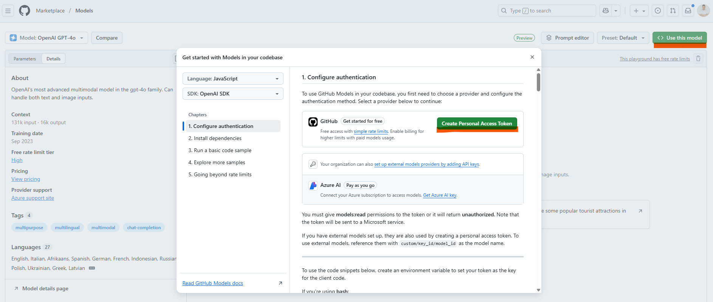
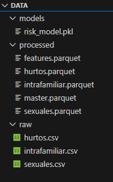

# Tablero Inteligente de Seguridad Ciudadana para Santander
                 
  


Este proyecto fue desarrollado como parte del concurso **Datos al Ecosistema 2025**, con el objetivo de mejorar la toma de decisiones institucionales y el acceso ciudadano a información crítica sobre seguridad en los municipios no certificados del departamento de Santander.

## Proyecto

https://herramientas.datos.gov.co/usos/vigi360
## Interactua con el Proyecto
Mira como funciona el aplicativo aqui: [MVP-Figma](https://text-serve-64613369.figma.site/)

## 🧱 Arquitectura del Proyecto.

```bash
santander-security/ 
├─ app/ # Backend FastAPI 
│ ├─ main.py # Punto de entrada de la API 
│ ├─ config.py # Rutas y configuración general 
│ ├─ routers/ # Endpoints organizados por dominio 
│ │ ├─ crimes.py # Consultas de delitos 
│ │ ├─ analytics.py # Predicción, métricas y visualización 
│ │ ├─ chatbot.py # Interacción comunitaria 
│ │ ├─ reports.py # Reportes ciudadanos en tiempo real (opcional) 
│ ├─ models/ # Esquemas Pydantic 
│ │ ├─ schemas.py
│ ├─ services/ # Lógica de negocio y procesamiento
│ │ ├─ etl.py # Ingesta y normalización de datos 
│ │ ├─ features.py # Derivación de variables (>25)
│ │ ├─ train.py # Entrenamiento de modelo ML 
│ │ ├─ explain.py # Explicabilidad con SHAP 
│ │ ├─ storage.py # Validación y cobertura 
│ │ ├─ chatbot.py # Generación de respuestas
│ ├─ data/
│ │ ├─ raw/ # CSV originales
│ │ ├─ processed/ # Parquet normalizados 
│ │ ├─ models/ # Modelos entrenados (*.pkl) 
│ │ ├─ logs/ # Logs de ejecución y API 
├─ scripts/ # Automatización 
│ ├─ bootstrap.sh # ETL + features + entrenamiento 
│ ├─ run_train.sh # Entrenamiento manual 
│ ├─ seed_demo.sh # Datos de prueba
├─ frontend/ # Aplicación React (mapa, filtros, chatbot) 
├─ dockerfile # Imagen backend 
├─ docker-compose.yml # Backend + Frontend 
├─ requirements.txt # Dependencias Python 
├─ README.md # Documentación del proyecto
```


## 🚀 Objetivo

Construir un tablero web inteligente que integre:
- Visualización geoespacial de delitos
- Modelos de Machine Learning explicables para predicción de riesgo
- Chatbot comunitario entrenado con datos locales

## 🧠 Datos utilizados

Se integraron más de 1 millón de registros provenientes de datos abiertos:

| Dataset | Fuente | Filas | Variables |
|--------|--------|-------|-----------|
| Delitos sexuales | [datos.gov.co](https://www.datos.gov.co/resource/fpe5-yrmw.csv) | 365K | 9 |
| Violencia intrafamiliar | [datos.gov.co](https://www.datos.gov.co/resource/vuyt-mqpw.csv) | 634K | 8 |
| Hurtos por modalidades | [datos.gov.co](https://www.datos.gov.co/resource/d4fr-sbn2.csv) | 43K | 9 |
| Ubicación geográfica de municipios	 | [geoportal.dane.gov.co](https://geoportal.dane.gov.co/descargas/divipola/DIVIPOLA_CentrosPoblados.csv) | 339 | 4 |

Se derivaron más de **26 variables** adicionales para análisis predictivo, cobertura, temporalidad y riesgo.

📌 Para la geolocalización de incidentes se utilizó el archivo oficial del DANE DIVIPOLA_CentrosPoblados.csv, filtrado por departamento = SANTANDER. 
Se hizo la unión por codigo_dane para garantizar precisión en las coordenadas.

## 🧩 Componentes

- **ETL y normalización**: limpieza, estandarización y unión de datasets
- **Feature engineering**: derivación de variables explicables
- **Modelo ML**: clasificación de riesgo alto por municipio/mes
- **API FastAPI**: endpoints para dashboard y chatbot
- **Chatbot comunitario**: respuestas preventivas basadas en datos locales

## 📊 Endpoints principales

| Endpoint | Descripción |
|---------|-------------|
| `/crimes/query` | Consulta de delitos por filtros |
| `/analytics/geo/heatmap` | Datos agregados para mapa |
| `/analytics/risk/predict` | Predicción de riesgo por municipio |
| `/analytics/metrics` | Métricas del modelo (AUC, F1, etc.) |
| `/chatbot/ask` | Preguntas ciudadanas con respuesta explicada |
|`/chatbot/quick/{tipo}` |Respuestas rápidas (estadisticas, prediccion, situacion) |
| `/reports/submit` | Reportes ciudadanos en tiempo real (opcional) |

## 🧪 Métricas del modelo

- Precisión clase 0: 0.98
- Recall clase 0: 1.00
- F1-score clase 0: 0.99
- Precisión clase 1: 1.00
- Recall clase 1: 0.99
- F1-score clase 1: 0.99
- Accuracy global: 0.99
- ROC-AUC: 1.000
- PR-AUC: 1.000
- 📌 El modelo se guarda automáticamente en:
```
app/data/models/risk_model.pkl
```
## ⚙️ Modelo, algoritmos y frameworks utilizados
Modelo principal: GradientBoostingClassifier (Scikit-learn)
- *Algoritmos:*
    - Gradient Boosting para clasificación binaria de riesgo
    - Validación temporal y externa con métricas ROC-AUC y PR-AUC
    - Feature engineering con más de 25 variables derivadas (temporales, demográficas, geoespaciales)

## Eejecución del Modelo
```
python -m app.services.etl --fetch
```
*Este comando corre todo el pipeline:*

- ETL → limpieza y normalización de datos
- Features → generación de features.parquet
- Train → entrenamiento del modelo y guardado en risk_model.pkl
- Validate → validación temporal y externa con métricas


## 🗺️ Impacto

- **Institucional**: focalización de recursos y agentes
- **Comunitario**: acceso ciudadano a información clara
- **Técnico**: IA explicable y auditable
- **Territorial**: identificación de zonas críticas

## 🧪 Cómo levantar todo

## Prerequisitos
- Python 3.9+
- Node.js version 20.19+ or 22.12+

### 1. Clona el proyecto y entra al directorio
```
https://github.com/LeoR22/Vigi360
```
Seleccionar el proyecto : Moverse al directorio principal
```
cd vigi360
```

### Crear entorno virtual
Puedes usar dependiendo de tu version de python:
```
python3 -m venv venv  
```
O puedes usar este comando
```
 python -m venv venv 
```
### Activar entorno virtual

**Para Linux/MacOS**

```
source venv/bin/activate
```

**En Windows:**

```
venv\Scripts\activate
```

### Instalar dependencias

```
pip install -r requirements.txt
```

### 🔐 Configuración del archivo .env para autenticación
Para habilitar el acceso a los modelos de GitHub, debes crear un archivo .env con las siguientes variables:
```
📄 Ruta del archivo: app/.env
```
🔑 Genera tu token personal en el siguiente enlace: 
[Playground de GitHub Models](https://github.com/marketplace/models/azure-openai/gpt-4o/playground)


🖼️ Ejemplo visual:


- Copias y pegas estas variables y añades tu token a la variable *GITHUB_TOKEN*
```
OPENAI_BASE_URL="https://models.inference.ai.azure.com"
OPENAI_EMBEDDINGS_URL="https://models.github.ai/inference"
GITHUB_TOKEN="[tu-github-token]"
```

# USO

### 1. Ejecutar modelo

```
python -m app.services.etl --fetch
```
- Se realiza el  ETL y se entrena el Modelo



### 2. Levantar proyecto local
**Ejecutar el servidor**: Para ejecutar el servidor de FastAPI, usa el siguiente comando:

   ```bash
   uvicorn app.main:app --reload
   ```
Esto iniciará la aplicación en <http://localhost:8000>.

### Frontend

1. **Abrir otro proyecto y cambiar de carpeta**:

   ```bash
   cd frontend
   ```

2. **Instalar dependencias:**:

   ```bash
   npm install
   ```

3. **Ejecutar el servidor**: Para ejecutar el frontend en modo de desarrollo:

   ```bash
   npm run dev
   ```
Esto iniciará la aplicación en <http://localhost:5173>.

## Si quieres levantar proyecto con Docker
### 2.1 Levanta backend + frontend
```
docker-compose up --build
```
### Acceso Backend y Frontend
```
Accede al backend en: http://localhost:8000/docs
Accede al frontend en: http://localhost:5173
```


## 🧪 Comandos de prueba (curl)

### Consulta delitos por municipio
```bash
curl -X POST http://localhost:8000/crimes/query -H "Content-Type: application/json" -d '{"municipio":"BUCARAMANGA","tipo_delito":"HURTO"}'
```

### Predicción de riesgo
```bash
curl "http://localhost:8000/analytics/risk/predict?departamento=SANTANDER&municipio=BUCARAMANGA&anio=2025&mes=10"
```

### Métricas del modelo
```bash
curl http://localhost:8000/analytics/metrics
```

### Pregunta al chatbot
```bash
curl -X POST http://localhost:8000/chatbot/ask -H "Content-Type: application/json" -d '{"pregunta":"¿Qué tan seguro es Bucaramanga en la noche?","municipio":"BUCARAMANGA"}'
```


## 👥 Equipo
- Leandro ⚡ – Data Engineer & Backend
- Gissell Trejos – Frontend & UX

---

## Contribuciones

**Si deseas contribuir a este proyecto, sigue estos pasos:**

1. Haz un fork del repositorio.
2. Crea una nueva rama (`git checkout -b feature-nueva-funcionalidad`).
3. Realiza tus cambios y haz commit (`git commit -m 'Agrega nueva funcionalidad'`).
4. Sube los cambios a la rama (`git push origin feature-nueva-funcionalidad`).
5. Abre un Pull Request.

## Licencia

Este proyecto está licenciado bajo la Licencia MIT. Consulta el archivo [LICENSE](LICENSE) para más detalles.

## Contacto

- Leandro Rivera: <leo.232rivera@gmail.com>
- Linkedin: <https://www.linkedin.com/in/leandrorivera/>
- Gissell Trejos: <gtrejosmarin@gmail.com>
- Linkedin:  <https://www.linkedin.com/in/gisselltrejosmarin>

### ¡Feliz Codificación! 🚀


Si encuentras útil este proyecto, ¡dale una ⭐ en GitHub! 😊


